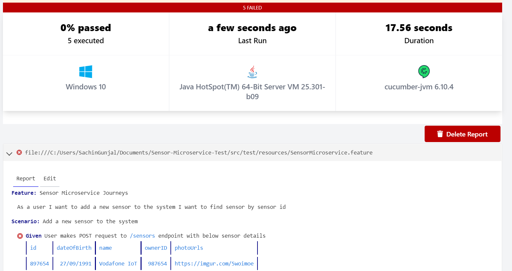

# Vodafone IoT API Test Framework

@Author: Sachin Gunjal

Tech Stack:
RestAssured,
Cucumber,
Java,
Maven

# Command to execute the test
mvn clean test   

(Check console for the report link -   Cucumber report will be published to the public repository and will be present for 24 hours, for example, https://reports.cucumber.io/reports/ef2d86e4-7b76-4fd2-ae1e-885bbf4ad085)

OR

Right click and run the feature file from IDE directly

# Cucumber Report:

Please note, tests are failed as there is no base url to hit the endpoint

